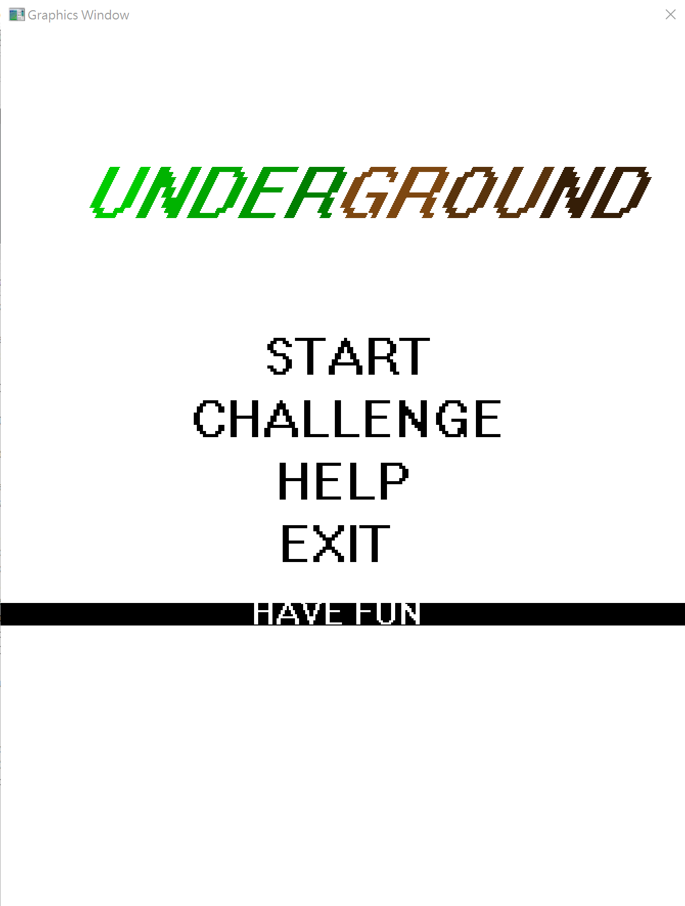
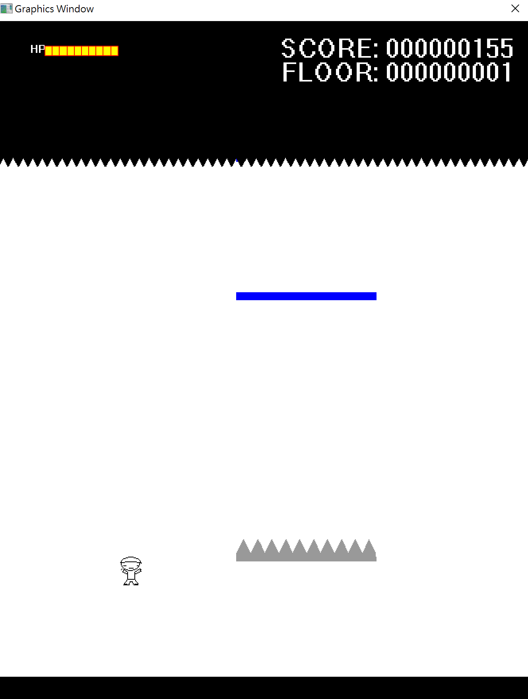

# underground
This is the final project of C Programming Topics at Zhejiang University. 

## Description
Underground is a game implemented by libgraphics and the IDE Dev C++.
It is based on NS-SHAFT and also added some of our ideas.

Different levels and random items is added to the game. Have Fun!

## Compile and Execute
* use cmake, make and gcc to compile and run it.
```
cd \build
cmake .. -G "MinGW Makefiles"
make
main.exe
```

## ScreenShots

